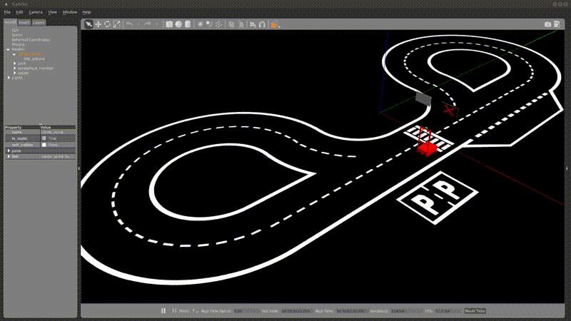
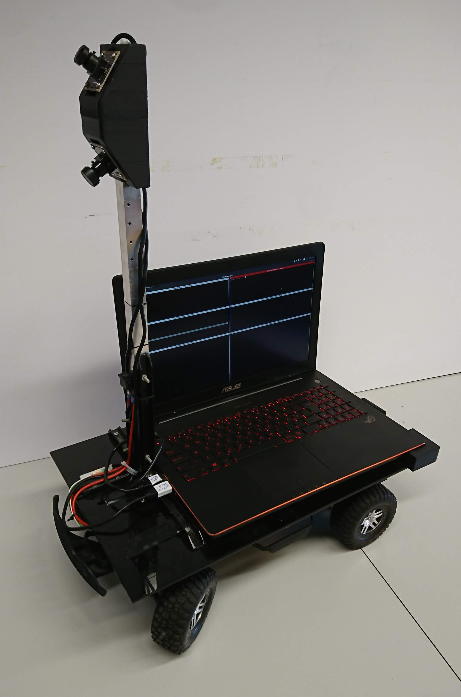
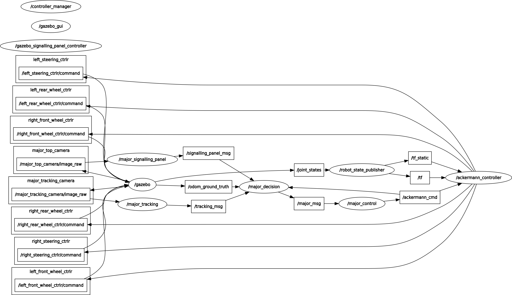

# [Autonomous Driving Simulator for the Portuguese Robotics Open](https://github.com/ee09115/conde_simulator)

[ROS Kinetic Support](https://github.com/ee09115/conde_simulator)

[ROS Indigo Support](https://bitbucket.org/ee09115/conde_simulator_student)

## Overview
The Autonomous Driving Competition (ADC) of the [Portuguese Robotics Open](https://web.fe.up.pt/~robotica2019/index.php/en/) (PRO) represents a medium complexity technical challenge in which a mobile robot completely devoid of human input during its runtime travels in a track (with a size of ~17x7m), Fig. 1, detects and identifies signalling panels projected in two ordinary monitors, recognizes traffic signs defined in the [competition ruling](https://web.fe.up.pt/~robotica2019/images/fnr2019_Autonomous_Driving.pdf), detects and avoids obstacles and is able to park in two different parking areas.

To overcome the need physical space to develop and deploy the code on the real robot, a simulator was created. Currently this simulator supports two different robots. The first one, named Conde, uses a differential driving steering locomotion (two small wheels coupled in two motors that controls its linear and angular movement) and a castor wheel to balance the structure. The sensors applied to the robot are three cameras. Two pointed down to see/navigate along the track and detect/avoid obstacles and one pointed up to detect/identify the signaling panels and traffic signs.

The second one, called Major Alvega uses a ackermann steering locomotion and two cameras as sensors (as in the Conde robot one of the cameras is pointed up to see the track and the other is pointed up to see the signalling panels and traffic signs). 

These two robots represent real world robots as shown in Fig. 2.

This simulator is able to replicate all of the autonomous driving competition challenges of the PRO.

* [1] - Conference Paper - [Design hints for efficient robotic vision - Lessons learned from a robotic platform](https://www.researchgate.net/publication/320384520_Design_Hints_for_Efficient_Robotic_Vision_-_Lessons_Learned_from_a_Robotic_Platform)
* [2] - Conference Paper - [Autonomous driving simulator for educational purposes](https://www.researchgate.net/publication/305769413_Autonomous_Driving_Simulator_for_Educational_Purposes)
* [3] - Journal Article - [Simulator for teaching robotics, ROS and autonomous driving in a competitive mindset](https://www.researchgate.net/publication/318510826_Simulator_for_Teaching_Robotics_ROS_and_Autonomous_Driving_in_a_Competitive_Mindset)
* [4] - Journal Article - [Design of an Embedded Multi-Camera Vision System - A Case Study in Mobile Robotics](https://www.researchgate.net/publication/323423499_Design_of_an_Embedded_Multi-Camera_Vision_System-A_Case_Study_in_Mobile_Robotics)
* [Presentation Guidelines](https://github.com/ee09115/conde_simulator/blob/master/presentations/10%20-%20Conde%20Auton%20Drv%20Simul.pdf)

	

	

Fig. 1 - On the left track for the 2017 autonomous driving competition, on the right real robot.

	
	

                 

Fig. 2 - On the left conde robot, on the right major alvega robot.

## Instalation and Dependencies
* ROS distro: [ROS Kinetic](http://wiki.ros.org/kinetic/Installation/Ubuntu)

* Ubuntu version: Ubuntu 16.04 LTS

* Gazebo version: Gazebo 7.0

Perform the full instalation for the ROS Kinetic that comes with Gazebo 7.0

## Building
Clone this repository into the src folder inside the catkin workspace and compile it.

## Running 
There are several launch files in the autonomous_driving_world package. To launch Major Alvega / Conde in the competition track run on of the following commands:

	roslaunch autonomous_driving_world spawn_major_in_competition_track_D1_D2_B1_P1.launch
	roslaunch autonomous_driving_world spawn_conde_in_competition_track_D1_D2_B1_P1.launch
	
For the driving with obstacles challenge run:

	roslaunch autonomous_driving_world spawn_major_in_competition_track_with_obstacles_D3_v1.launch
	roslaunch autonomous_driving_world spawn_major_in_competition_track_with_obstacles_D3_v2.launch
	roslaunch autonomous_driving_world spawn_conde_in_competition_track_with_obstacles_D3_v1.launch
	roslaunch autonomous_driving_world spawn_conde_in_competition_track_with_obstacles_D3_v2.launch

For the driving with obstacles and work zone challenge run:

	roslaunch autonomous_driving_world spawn_major_in_competition_track_with_obstacles_and_construction_cones_D4.launch
	roslaunch autonomous_driving_world spawn_conde_in_competition_track_with_obstacles_and_construction_cones_D4.launch

For the parallel parking challenge with obstacles run:

	roslaunch autonomous_driving_world spawn_major_in_competition_track_with_parking_obstacles_P2.launch
	roslaunch autonomous_driving_world spawn_conde_in_competition_track_with_parking_obstacles_P2.launch
	
For the bay parking challenge with obstacle run one of the following commands:

	roslaunch autonomous_driving_world spawn_major_in_competition_track_with_parking_obstacles_B2_v1.launch
	roslaunch autonomous_driving_world spawn_major_in_competition_track_with_parking_obstacles_B2_v2.launch
	roslaunch autonomous_driving_world spawn_conde_in_competition_track_with_parking_obstacles_B2_v1.launch	
	roslaunch autonomous_driving_world spawn_conde_in_competition_track_with_parking_obstacles_B2_v2.launch
	
To spawn the traffic signs in the world run:

	roslaunch autonomous_driving_world spawn_major_in_competition_track_with_traffic_signs_V1.launch
	roslaunch roslaunch autonomous_driving_world spawn_conde_in_competition_track_with_traffic_signs_V1.launch

Controlling the signalling panels run, Fig. 2:

	rosrun gazebo_signalling_panel_control gazebo_signalling_panel_control_node
	
Controlling the traffic signs run:

	rosrun gazebo_traffic_sign gazebo_traffic_sign_node

## Documentation

To help understanding the challenges of the ADC of the PRO videos for each challenge using Conde and Major Alvega robots were recorded:

| Challenges | Video Link                                           |
|------------|------------------------------------------------------|
| D1         | [Major Alvega](https://www.youtube.com/watch?v=kZ8AtOi5CXE) / [Conde](https://www.youtube.com/watch?v=KdPtip8yreg) |
| D2         | [Major Alvega](https://www.youtube.com/watch?v=Npi2Fvg-5bw) / [Conde](https://www.youtube.com/watch?v=4Lam-rKk5JA) |
| D3         | [Major Alvega](https://www.youtube.com/watch?v=px70RG88V_U) / [Conde](https://www.youtube.com/watch?v=QjDzB3g44ak) |
| P1		 | [Major Alvega](https://www.youtube.com/watch?v=Bo3F3RGVwlc) / [Conde](https://www.youtube.com/watch?v=poQimovxVSk) |
| P2		 | [Major Alvega](https://www.youtube.com/watch?v=x5cbeOPqTBM) / [Conde](https://www.youtube.com/watch?v=TQu3sS1hqa8) |
| B1		 | [Major Alvega](https://www.youtube.com/watch?v=QMfUgqCJXfQ) / [Conde](https://www.youtube.com/watch?v=T2Js-yEaR-A) |
| B2		 | [Major Alvega](https://www.youtube.com/watch?v=NkwoMAGI4Q4) / [Conde](https://www.youtube.com/watch?v=KSer8wIuqUg) |

### ROS architecture for Conde 

### Short description of ROS nodes - Conde
* conde_tracking - it is responsible for the detection of the track 
* conde_signalling_panel - it is responsible to recognize the signalling panels
* conde_traffic_sign - it is responsible to recognize the traffic signs
* conde_decision - it is responsible for all the decisions followed by the robot (it is the intelligence of the robot)
* conde_control - it is responsible to calculate the velocities accordingly to the reference to follow
* conde_key_teleop - it controls the robot's movement manually by publishing a /cmd_vel message

### ROS architecture for Major Alvega 

### Short description of ROS nodes - Major Alvega
* major_tracking - it is responsible for the detection of the track 
* major_signalling_panel - it is responsible to recognize the signalling panels
* major_traffic_sign - it is responsible to recognize the traffic signs
* major_decision - it is responsible for all the decisions followed by the robot (it is the intelligence of the robot)
* major_control - it is responsible to calculate the velocities accordingly to the reference to follow

### Short description of ROS nodes - General Packages
* autonomous_driving_world - simulation world representing the autonomous driving competition of the portuguese robotics open
* gazebo_traffic_sign_control - it controls the traffic sign displayed in the conde_world
* gazebo_signalling_panel_control - it controls the signalling panels displayed in conde_world through a terminal menu

## How to cite
If you use this simulator please cite articles [2] and [3]:

	@article{Costa2017c,
	author = {Costa, Valter and Rossetti, Rosaldo and Sousa, Armando},
	doi = {10.4018/IJTHI.2017100102},
	issn = {1548-3908},
	journal = {International Journal of Technology and Human Interaction},
	month = {oct},
	number = {4},
	pages = {19--32},
	title = {{Simulator for Teaching Robotics, ROS and Autonomous Driving in a Competitive Mindset}},
	url = {http://services.igi-global.com/resolvedoi/resolve.aspx?doi=10.4018/IJTHI.2017100102},
	volume = {13},
	year = {2017}
	}
	
	@inproceedings{Costa2016a,
	author = {Costa, Valter and Rossetti, Rosaldo J.F. and Sousa, Armando},
	booktitle = {2016 11th Iberian Conference on Information Systems and Technologies (CISTI)},
	doi = {10.1109/CISTI.2016.7521461},
	isbn = {978-9-8998-4346-2},
	issn = {21660735},
	month = {jun},
	pages = {1--5},
	publisher = {IEEE},
	title = {{Autonomous driving simulator for educational purposes}},
	url = {http://ieeexplore.ieee.org/document/7521461/},
	year = {2016}
	}
	
